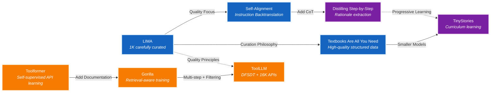
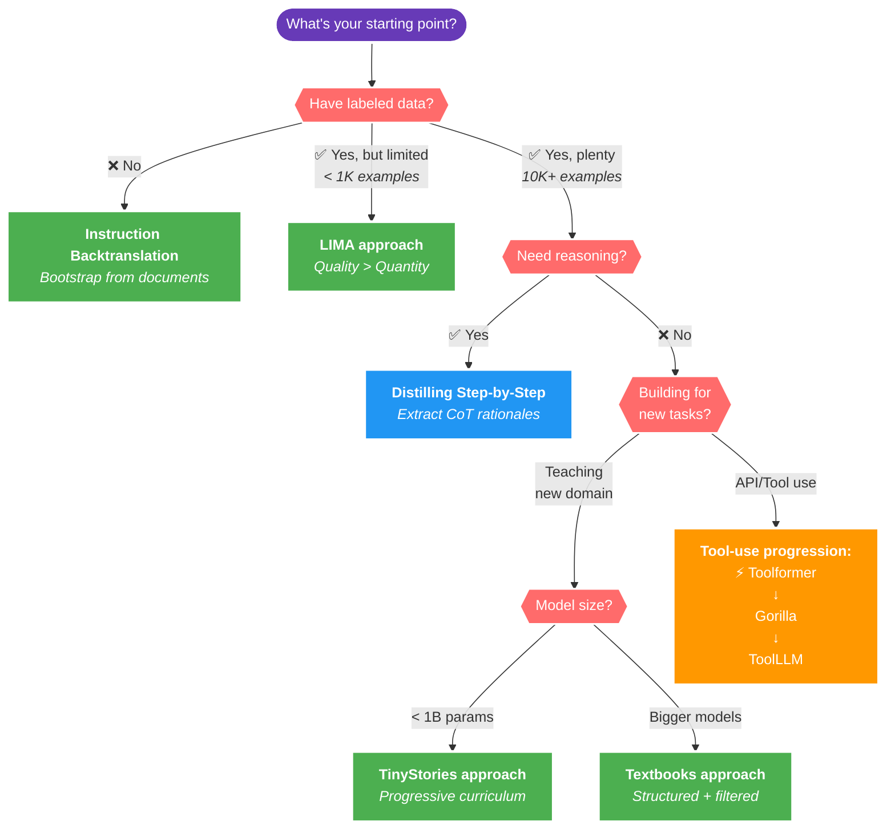

<div align="center">

# Awesome Synthetic Data Papers 🚀


**A curated progression of techniques along with implementations for generating high-quality synthetic data for LLM fine-tuning**

</div>

**Goal:** The goal of this list is to present a mini roadmap of great papers along with their key ideas implemented using synthetic data kit. The focus is on simple ideas that work well in practise.

> Note: The list presents a curated list of great papers along with certain key ideas presented in a simplified manner. These papers cover a lot of great details and the ideas are simplified to a single line as well as focussed on how to quickly get started with [synthetic-data-kit](https://pypi.org/project/synthetic-data-kit/). Please checkout their respective links to learn all the details presented. Contributions are always welcomed!

<details>
<summary><b>Papers Roadmap</b> (click to expand)</summary>



A curated list of papers on synthetic data generation for training language models, organized progressively.

</details>


## Which Approach Should You Use?

<b>Decision flowchart</b>



### Quick TL;DR:

Below is a very quick summary of the roamap:

- **No labeled data?** Use [**Self-Alignment with Instruction Backtranslation**](#2-self-alignment-with-instruction-backtranslation) to generate high-quality examples from raw text
- **Limited high-quality data?** Follow the [**LIMA approach**](#1-lima-less-is-more-for-alignment) with extreme curation focus
- **Need to create small reasoning model?** Apply [**Distilling Step-by-Step**](#3-distilling-step-by-step-outperforming-larger-language-models) to add CoT to your examples
- **Teaching a new domain?** Use a [**TinyStories approach**](#4-tinystories-how-small-can-language-models-be-and-still-speak-coherent-english) with progressively complex content
- **Building tools and API integrations?** Read the [**Toolformer**](#6-toolformer-language-models-can-teach-themselves-to-use-tools), add documentation like [**Gorilla**](#7-gorilla-large-language-model-connected-with-massive-apis), then apply filtering from [**ToolLLM**](#8-toolllm-facilitating-large-language-models-to-master-16000-real-world-apis)

## Contents
- [LIMA: Less Is More for Alignment](#1-lima-less-is-more-for-alignment) `#quality` `#curation`
- [Self-Alignment with Instruction Backtranslation](#2-self-alignment-with-instruction-backtranslation) `#quality` `#self-improvement`
- [Distilling Step-by-Step! Outperforming Larger Language Models](#3-distilling-step-by-step-outperforming-larger-language-models) `#reasoning` `#distillation`
- [TinyStories: How Small Can Language Models Be](#4-tinystories-how-small-can-language-models-be-and-still-speak-coherent-english) `#small-models` `#curriculum`
- [Textbooks Are All You Need](#5-textbooks-are-all-you-need) `#quality` `#progressive-learning`
- [Toolformer: Language Models Can Teach Themselves to Use Tools](#6-toolformer-language-models-can-teach-themselves-to-use-tools) `#tool-use` `#self-improvement`
- [Gorilla: Large Language Model Connected with Massive APIs](#7-gorilla-large-language-model-connected-with-massive-apis) `#tool-use` `#documentation`
- [ToolLLM: Facilitating Large Language Models to Master 16000+ Real-world APIs](#8-toolllm-facilitating-large-language-models-to-master-16000-real-world-apis) `#tool-use` `#quality-filtering`

---

For all implementations, we will show how to use the synthetic-data-kit in a minimal example. Learn how to get started [here](https://github.com/meta-llama/synthetic-data-kit/tree/main/use-cases/getting-started)

Just follow the following for quick commands:

`pip install synthetic-data-kit`

`synthetic-data-kit --help`

## 1. **LIMA: Less Is More for Alignment**

**Key idea:** How many QA examples are enough for strong results? As low as 1000 carefully curated examples show great results - focus on Curating and Quality!

> Caveat: This depends on the domain and the gap in the model's existing knowledge. However, the point is you can get great results even as low as 1000 examples are great!

**Extra ideas worth highlighting:**
- Diversity matters more than quantity - examples should span different formats and domains
- High quality curation consistently beats automated filtering approaches

<details>
<summary><b>Applying in practice</b> (click to expand)</summary>

```bash
# Create a custom config that emphasizes quality over quantity
cat > lima_config.yaml << EOF
llm:
  provider: "vllm"

vllm:
  api_base: "http://localhost:8000/v1"
  model: "meta-llama/Llama-3.3-70B-Instruct"

# Generate fewer but higher quality examples
generation:
  temperature: 0.5
  num_pairs: 30  # Start with a manageable number

# Set a high quality threshold for LIMA-style curation
curate:
  threshold: 8.5  # Only keep the highest quality examples
  batch_size: 8
```

```# Apply strict quality filtering (LIMA's core principle)
synthetic-data-kit -c lima_config.yaml curate path/to_qa_pairs.json

# Save in your preferred fine-tuning format
synthetic-data-kit -c lima_config.yaml save-as data/cleaned/document_cleaned.json -f chatml
```
</details>

**[Link to the paper](https://arxiv.org/abs/2305.11206)**

---

## 2. **Self-Alignment with Instruction Backtranslation**

**Key idea:** If you lack QA pairs and have a lot of information in various documents: You can prompt a LLM to convert your documents to QA pairs and then curate these via LLM as a judge

**Extra ideas worth highlighting:**
- Iterative self-improvement without human annotation
- Quality scoring (1-5 scale) by the model itself for curation
- Use different system prompts for seed vs generated data

<details>
<summary><b>Applying in practice</b> (click to expand)</summary>

Note: This is what synthetic-data-kit offers out of box when you `ingest` and `create` from various file formats

```bash
# Process workflow: ingest → create → curate → save-as
# 1. Convert your documents to text
synthetic-data-kit -c self_align_config.yaml ingest data/pdf/technical_document.pdf

# 2. Generate instruction-response pairs with customized prompt
synthetic-data-kit -c self_align_config.yaml create data/output/technical_document.txt -n 50

# 3. Self-critique with the LLM as judge
synthetic-data-kit -c self_align_config.yaml curate data/generated/technical_document_qa_pairs.json -t 7.5

# 4. Save in a fine-tuning format
synthetic-data-kit -c self_align_config.yaml save-as data/cleaned/technical_document_cleaned.json -f alpaca
```
</details>

**[Link to the paper](https://arxiv.org/abs/2308.06259)**

---

## 3. **Distilling Step-by-Step! Outperforming Larger Language Models**

**Key idea:** Extract Chain-of-Thought reasoning from large models to train smaller models that can outperform their teachers.

**Extra ideas worth highlighting:**
- Paper shows up to 2000x model size reduction with similar performance (Note: This obviously depends on the domain)
- Teaches smaller models rationale
- Small models can outperform their teachers with this approach

<details>
<summary><b>Applying in practice</b> (click to expand)</summary>

```bash
# Two approaches for CoT distillation:

# APPROACH 1: Generate CoT examples from scratch
# 1. Generate new CoT examples from a document
synthetic-data-kit -c cot_distill_config.yaml create data/output/reasoning_document.txt --type cot

# 2. Save in your preferred fine-tuning format
synthetic-data-kit -c cot_distill_config.yaml save-as data/generated/reasoning_document_cot_examples.json -f chatml

# APPROACH 2: Enhance existing QA pairs with CoT reasoning
# 1. First create a JSON file with conversations/QA pairs
# Example: existing_qa_pairs.json containing Q&A pairs or conversations

# 2. Enhance the existing conversations with CoT reasoning
synthetic-data-kit -c cot_distill_config.yaml create data/existing_qa_pairs.json --type cot-enhance

# 3. Save the enhanced dataset
synthetic-data-kit -c cot_distill_config.yaml save-as data/generated/existing_qa_pairs_enhanced.json -f chatml
```
</details>

**[Link to the paper](https://arxiv.org/abs/2305.02301)**

---

## 4. **TinyStories: How Small Can Language Models Be and Still Speak Coherent English?**

**Key idea:** Great idea if you're starting to teach a model from scratch or teaching it a new domain. Simplify the concepts and teach it in a progressive curriculum

**Extra ideas worth highlighting:**
- Models as small as 1M parameters can generate coherent text

<details>
<summary><b>Applying in practice</b> (click to expand)</summary>

```bash
# Create a config for TinyStories-style simple examples
cat > tiny_stories_config.yaml << EOF
llm:
  provider: "api-endpoint"

api-endpoint:
  api_base: "https://api.llama.com/v1"
  model: "Llama-3-70B-Instruct"

generation:
  temperature: 0.7
  num_pairs: 15

prompts:
  # Custom prompt for generating simple stories
  qa_generation: |
    Create {num_pairs} simple stories for teaching basic language skills.
    
    Requirements:
    1. Use only the 1500 most common English words
    2. Keep sentences short and simple (5-8 words per sentence)
    3. Each story should teach a basic concept (colors, numbers, animals, etc.)
    4. Include a simple question at the end that tests understanding
    
    Format each as a question-answer pair:
    
    [
      {
        "question": "Read this story and answer the question at the end: [STORY WITH QUESTION]",
        "answer": "Simple, clear answer using only basic vocabulary"
      }
    ]
    
    Text:
    {text}

  # Custom prompt for progressive difficulty curation
  qa_rating: |
    Rate these educational stories on a scale of 1-10 based on:
    
    - Simplicity (0-3): Uses only basic vocabulary and simple sentences
    - Educational value (0-3): Teaches a useful concept clearly
    - Engagement (0-2): Would hold a young learner's attention
    - Progression (0-2): Builds on fundamental concepts appropriately
    
    Also add a "difficulty" field rated 1-5 (1=simplest, 5=most advanced)
    
    Return as valid JSON:
    [
      {
        "question": "Original question with story",
        "answer": "Original answer",
        "rating": 8,
        "difficulty": 2
      }
    ]
    
    Stories to rate:
    {pairs}
EOF

# Generate simple TinyStories-style content
# 1. Start with a simple source document (can be anything)
synthetic-data-kit -c tiny_stories_config.yaml create data/output/source_document.txt

# 2. Rate examples including difficulty level
synthetic-data-kit -c tiny_stories_config.yaml curate data/generated/source_document_qa_pairs.json

# 3. Create a curriculum by organizing by difficulty level
# (This would require post-processing the output JSON to sort by difficulty)
mkdir -p data/curriculum/level_{1..5}

# 4. Save in a format for fine-tuning
synthetic-data-kit -c tiny_stories_config.yaml save-as data/cleaned/source_document_cleaned.json -f jsonl
```
</details>

**[Link to the paper](https://arxiv.org/abs/2305.07759)**

---

## 5. **Textbooks Are All You Need**

**Key idea:** High-quality 'textbook-style' synthetic data with careful filtering enables small models to outperform much larger ones

**Extra ideas worth highlighting:**
- Focus on teaching concepts progressively, not memorization
- Data quality and structure >> raw scale

<details>
<summary><b>Applying in practice</b> (click to expand)</summary>

```bash
# Create a config for textbook-quality data generation
cat > textbook_config.yaml << EOF
llm:
  provider: "vllm"

vllm:
  api_base: "http://localhost:8000/v1"
  model: "meta-llama/Llama-3.3-70B-Instruct"

generation:
  temperature: 0.2  # Lower temperature for more precise output
  num_pairs: 15

curate:
  threshold: 9.0  # Extremely high quality bar
  batch_size: 5   # Smaller batch for more careful evaluation

prompts:
  # Custom prompt for generating textbook-quality content
  qa_generation: |
    Create {num_pairs} high-quality textbook-style examples that explain important concepts clearly.
    
    Requirements:
    1. Structure each example as a concept explanation followed by exercise questions
    2. Include clear definitions, examples, and step-by-step reasoning
    3. Ensure explanations build on fundamental concepts before introducing complex ones
    4. Use precise, unambiguous language as found in high-quality textbooks
    
    Format as question-answer pairs:
    [
      {
        "question": "Explain concept X and solve the following problem: [PROBLEM]",
        "answer": "Detailed textbook-style explanation with step-by-step solution"
      }
    ]
    
    Text:
    {text}

  # Custom prompt for textbook-quality rating
  qa_rating: |
    Rate these educational examples on a scale of 1-10 based on:
    
    - Clarity (0-3): Is the explanation clear, precise, and unambiguous?
    - Pedagogical value (0-3): Does it build concepts progressively?
    - Accuracy (0-2): Is all information factually correct?
    - Exercise quality (0-2): Do exercises reinforce the concepts effectively?
    
    Rate EXTREMELY strictly - only the highest quality examples should score above 8.
    
    Return valid JSON with ratings:
    [
      {"question": "Original question", "answer": "Original answer", "rating": 9}
    ]
    
    Examples to rate:
    {pairs}
EOF

# Generate and curate textbook-quality content
# 1. Generate from source material or educational content
synthetic-data-kit -c textbook_config.yaml create data/output/source_material.txt

# 2. Apply extremely strict quality filtering
synthetic-data-kit -c textbook_config.yaml curate data/generated/source_material_qa_pairs.json

# 3. Save as high-quality fine-tuning data
synthetic-data-kit -c textbook_config.yaml save-as data/cleaned/source_material_cleaned.json -f chatml --storage hf
```
</details>

**[Link to the paper](https://arxiv.org/abs/2306.11644)**

---

## 6. **Toolformer: Language Models Can Teach Themselves to Use Tools**

**Key idea:** The first paper that showed models can be taught to perform API and tool calling

**Extra ideas worth highlighting:**
- Self-supervised learning of when and how to use tools
- Model decides autonomously when tools would help

**[Link to the paper](https://arxiv.org/abs/2302.04761)**

---

## 7. **Gorilla: Large Language Model Connected with Massive APIs**

**Key idea:** When performing SFT for tool calling, including documentation of the API improves the model

**Extra ideas worth highlighting:**
- Retrieval-aware training significantly reduces hallucination
- Trained on 1,600+ ML API documentations (Torch, TensorFlow, HuggingFace)
- API documentation in context is crucial for accuracy

<details>
<summary><b>Applying in practice</b> (click to expand)</summary>

```bash
# Create a config focused on API documentation
cat > gorilla_config.yaml << EOF
llm:
  provider: "vllm"

vllm:
  api_base: "http://localhost:8000/v1"
  model: "meta-llama/Llama-3.3-70B-Instruct"

generation:
  temperature: 0.3
  num_pairs: 15

curate:
  threshold: 8.0  # High bar for API accuracy
  batch_size: 10

prompts:
  # Custom rating prompt for API documentation quality
  qa_rating: |
    Rate these API usage examples on a scale from 1-10 based on:
    
    - Documentation quality (0-3): Is the API documentation clear and complete?
    - API call correctness (0-3): Is the syntax and usage correct?
    - Explanation quality (0-2): Is the explanation helpful and accurate?
    - Parameter coverage (0-2): Are parameters well explained and correctly used?
    
    Immediately reject any example where the API call doesn't match the documentation.
    
    Return valid JSON with ratings:
    [
      {"question": "Original question", "answer": "Original answer with documentation", "rating": 8}
    ]
    
    Examples to rate:
    {pairs}
    
  # Custom prompt for enhancing examples with documentation
  cot_enhancement: |
    You are enhancing API usage examples by adding detailed documentation.
    
    For each conversation, add the following to the assistant's responses:
    1. Relevant API documentation with syntax and parameter descriptions
    2. Clear explanation of why this API is appropriate
    3. Description of what each parameter does
    
    Return the enhanced conversations as a JSON array matching this format:
    [
      {
        "role": "system", 
        "content": "System message"
      },
      {
        "role": "user", 
        "content": "How do I use function X?"
      },
      {
        "role": "assistant", 
        "content": "Here's the documentation for this API:\n\n```\nfunction X(param1, param2) -> return_type\n  param1: description of param1\n  param2: description of param2\n  returns: what is returned\n```\n\nHere's how you can use it:\n\n```python\nresult = X(value1, value2)\n```\n\nThis works because [detailed explanation]..."
      }
    ]
    
    Original conversations:
    {conversations}
EOF

# Enhance existing examples with documentation using cot-enhance
# 1. First prepare a JSON file with basic API usage examples (without detailed docs)
# Example: api_examples.json with basic Q&A pairs about APIs

# 2. Enhance these examples by adding detailed documentation
synthetic-data-kit -c gorilla_config.yaml create data/api_examples.json --type cot-enhance

# 3. Save the enhanced dataset
synthetic-data-kit -c gorilla_config.yaml save-as data/generated/api_examples_enhanced.json -f chatml
```
</details>

**[Link to the paper](https://arxiv.org/abs/2305.15334)**

---

## 8. **ToolLLM: Facilitating Large Language Models to Master 16000+ Real-world APIs**

**Key idea:** Combines insights from Toolformer & Gorilla, introduces DFSDT to generate and filter high-quality multi-step tool-use examples

**Extra ideas worth highlighting:**
- DFSDT prevents error cascading in complex multi-step tasks
- Covers 16k real-world REST APIs across 49 categories
- Automatic evaluation framework (ToolEval) for tool-use capabilities

**[Link to the paper](https://arxiv.org/abs/2307.16789)**

---

## Contributing

This is a living document intended to curate synthetic data generation techniques for LLMs. We welcome contributions!